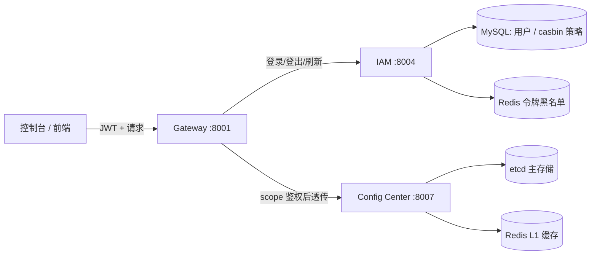
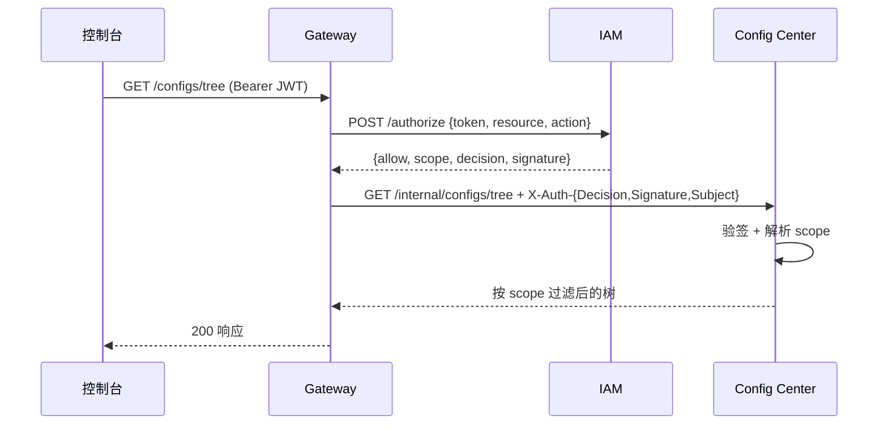

# OpsHub 运控配置台 · 整体逻辑说明

本文档介绍 OpsHub 的总体设计、权限模型、鉴权链路、Redis 混存方案与接口清单，
帮助理解「运控配置台」后端各模块的职责与数据流，也便于后续继续扩展。

## 1. 总体架构

OpsHub 由三个可独立部署的 Go 服务组成，前端（控制台）统一只访问 **网关**：



| 模块 | 职责 | 端口 |
|---|---|---|
| **Gateway** | 统一入口：JWT 校验、限流、向 IAM 取 scope、向配置中心透传、向 IAM 透传用户/策略管理 | 8001 |
| **IAM** | 身份验证（登录/登出/刷新）、鉴权（casbin RBAC）、配置授权（scope）管理 | 8004 |
| **Config Center** | 配置的增删改查、业务/模块/列表三层浏览、按 scope 过滤与写权限校验、etcd 持久化 + Redis 混存 | 8007 |

## 2. 配置分层模型（业务 → 模块 → 具体列表）

配置逻辑键统一为 `business/module/name`（三段式），例如：

- `pay/gateway/timeout_ms` —— 业务 `pay` / 模块 `gateway` / 配置项 `timeout_ms`
- `pay/order/limit`
- `cdn/vod/bitrate`

> 单段 key（如 `debug`）兼容保留，视为业务级配置（模块为空）。

控制台浏览接口：

| 方法 | 路径 | 说明 |
|---|---|---|
| GET | `/configs/tree` | 完整层级树（左侧导航） |
| GET | `/configs/tree/{business}` | 业务子树 |
| GET | `/configs/tree/{business}/{module}` | 模块下配置项列表 |
| GET/PUT/DELETE | `/configs/tree/{business}/{module}/{name}` | 具体项读写删 |
| GET/POST/PUT/DELETE | `/configs`、`/configs/{key}` | 扁平 CRUD（兼容） |

配置中心同时暴露 `/configs` 与 `/internal/configs` 两套路由：前者可直连（需携带 scope 头），
后者供网关内部透传使用。

## 3. 权限模型

"每个人都有对某些业务、某些模块、某些配置项的管理权限"。

### 3.1 授权对象（obj）规范

基于 casbin 的 `globMatch`（doublestar 语义，`*` 不跨 `/`，`**` 跨 `/`）：

| 授权对象 | 含义 |
|---|---|
| `config/**` | 全部配置 |
| `config/pay/**` | 整个 `pay` 业务 |
| `config/pay/gateway/**` | `pay` 下 `gateway` 模块 |
| `config/pay/gateway/timeout_ms` | 某个具体配置项 |
| `config/default/debug` | 单段 key（业务级配置） |

### 3.2 动作（act）

`read`（读）、`write`（写/改）、`delete`（删）、`grant`（授权他人）、`*`（全部）。

### 3.3 scope（授权列表）

用户最终有效授权 = 直接 casbin 策略 + 角色继承（`GetImplicitPermissionsForUser`）。
管理员恒等于 `[{obj: config/**, act: *}]`。

IAM 签发 scope 载体并签名：

```
payload = scope|<subject>|<grantsJSON>|<unix>
signature = HMAC-SHA256(payload, decisionSecret)
```

## 4. 鉴权链路（关键）



要点：

1. **网关只做身份与路由**：JWT 校验后，向 IAM 取 scope 并原样透传 `X-Auth-Decision`/`X-Auth-Signature`/`X-Auth-Subject`。
2. **配置中心做精确授权执行**：验签防止伪造，然后按 scope 过滤与校验。
3. **错误语义**：
   - 无任何配置授权 → 网关层 403（连入口都进不去）。
   - 有部分授权，但访问无权限的业务/模块/项（读）→ **404 `permission denied`**（不泄露配置是否存在）。
   - 有读权限但写/删无权限 → **403 `permission denied: write/delete`**。

### 4.1 IAM /authorize 对配置的判定

- 管理员：恒放行。
- 普通用户 **读**（GET/HEAD）：只要拥有任意配置授权即放行（精确过滤交给配置中心）。
- 普通用户 **写/删**（POST/PUT/DELETE）：按具体资源精确 casbin 校验，未授权直接 403。

## 5. Redis 混存（etcd 主存 + Redis 缓存）

选型结论：**etcd 作为配置的唯一事实来源**（前缀列举契合分层 key、强一致、可 Watch 实时推送）；
**Redis 作为 L1 读缓存**（cache-aside），不做主存储。

配置中心读写策略：

```
读: 查 Redis(opshub:config:list / item:<key>) → 命中返回
    → 未命中回源 etcd/内存 → 回填 Redis(TTL 5m)
写: 写 etcd/内存成功后 → 失效 Redis(list + item:<key>)
```

- 缓存为**可选**：`redis.enabled` 为 `nil`（自动）时尝试连接，失败自动降级不启用，不影响服务可用性。
- 树/业务/模块浏览基于 `List()`，因此自动受益于列表缓存。

Redis 的另一个用途：**IAM 登出令牌黑名单**（`opshub:iam:blacklist:<token>`，TTL=令牌剩余有效期），
补齐了原先 `logout` 空操作的缺口。

## 6. 接口清单（经网关）

### 认证
| 方法 | 路径 | 说明 |
|---|---|---|
| POST | `/login` `/logout` `/refresh` | 登录 / 登出（黑名单）/ 刷新令牌 |
| POST | `/signup` | 注册（透传 IAM） |

### 配置（scope 鉴权）
| 方法 | 路径 |
|---|---|
| GET | `/configs` `/configs/tree` `/configs/tree/{b}` `/configs/tree/{b}/{m}` `/configs/tree/{b}/{m}/{n}` |
| GET | `/configs/pull`（下游服务拉取快照，支持层级过滤与增量，见下） |
| GET | `/configs/history/{key}`（历史 + 当前值对比） |
| POST | `/configs` |
| PUT | `/configs/{key}` `/configs/tree/{b}/{m}/{n}` |
| DELETE | `/configs/{key}` `/configs/tree/{b}/{m}/{n}` |

### 配置历史与差异
- 每次写操作（create/update/delete）都会留一条审计记录，字段含 **`before` / `after`** 两份内容。
- 后端只负责提供变更前后内容，**差异对比由前端公共库完成**（前端 `web/` 内置行级 LCS diff，
  如需更强能力可换 jsdiff）。
- 历史存储：etcd 模式存到 sibling prefix（`<config-prefix>/audit`），跨实例共享；内存模式存进程内。

## 6.5 运控台前端（web/）

- 纯静态 SPA（无构建依赖），由 **网关统一入口** 提供（同源免跨域）：
  - `GET /` → `index.html`；`GET /static/*` → 静态资源。
- 三个页面（顶部 Tab 切换）：
  1. **配置管理**：业务/模块树 → 配置项列表（新增/编辑/删除）→ 历史与差异对比。
  2. **用户管理**：用户列表 / 新增 / 编辑 / 改密 / 删除 / 查看授权（`/users`、`/signup`、`/users/{name}` 等）。
  3. **权限管理**：按 业务/模块/项 授权与撤销（`/policies/config-grant|revoke`）、角色绑定、策略列表。
- 右上角展示「我的权限」（`/scope`）。
- 启动后访问 `http://127.0.0.1:8001/`（网关端口）。
- 部署：`build.sh` 会把 `web/` 复制到 `output/web`，网关自动定位并服务。
- 注意：fasthttp 压缩静态文件会生成 `*.fasthttp.br` 缓存，已加入 `.gitignore`。

## 6.6 下游服务拉取配置（demo）

专门的业务服务通过 `pkg/configclient` 拉取配置，支持**任意层级**与**增量判断更新**：

```
cli := configclient.New("http://127.0.0.1:8004", "http://127.0.0.1:8007")
cli.Login(ctx, user, pass)

items, _ := cli.Pull(ctx)                // 全量快照（自动 authorize 携带 scope）
items, _ = cli.PullByBusiness(ctx, "pay") // 只拉 pay 业务
items, _ = cli.PullPath(ctx, "pay/gateway") // 只拉 pay/gateway 前缀
items, _ = cli.PullKey(ctx, "pay/gateway/timeout_ms") // 精确一项

// 增量：记录上次 revision，之后只拉变更项 + 被删 key
res, _ := cli.PullSince(ctx, rev)
if res.HasChanged(rev) { /* 有变化：应用 res.Items、删除 res.Removed，更新 rev=res.Revision */ }
```

### /configs/pull 参数（可组合）

| 参数 | 说明 |
|---|---|
| `business` / `module` / `name` | 业务/模块/具体项三级（name 需带 business+module） |
| `path=pay/gateway` | key 为 `pay/gateway` 或以 `pay/gateway/` 开头（层级前缀） |
| `key=pay/gateway/timeout_ms` | 精确一个 key |
| `since=<rev>` | 增量：只返回全局版本号 > rev 的变更项 + `removed`（被删 key），响应带最新 `revision` |

响应：`{revision, items, removed, generated_at}`。

- **全局版本号**：每次写操作单调 +1（etcd 用事务 CAS 原子递增，存保留 key `@revision`；内存模式用原子计数）。
- **增量语义**：基于审计变更日志（`ConfigChange.Revision`）推导，删除感知可靠；未配置审计（纯内存且进程重启）时增量不完整，建议生产用 etcd audit。
- 所有结果按当前用户 scope 过滤可读项。
- 客户端封装了「登录 IAM → authorize 取 scope → 携带 X-Auth-* 头调用 `/configs/pull`」完整链路。
- **服务凭证（AccessKey）**：下游服务用 `AccessKeyID + AccessKeySecret` 自签 JWT（header `kid`）认证，替代账号密码；iam 按 `kid` 查库验签（`parseToken` 的 kid 分支），身份以凭证归属的服务账号为准。
- **模块订阅（只读）**：管理员经 `/services/{name}/modules` 注册服务可拉取的业务/模块（注册即授 read、默认不授写/删），未订阅模块拉不到；`configclient.PullSubscribed` 按订阅拉取。
- **本地落盘**：`configclient.WriteTo(items, dir)` 按业务/模块写 `<dir>/<business>/<module>.json`（key→value JSON，value 为配置 JSON 字符串）；默认数据目录与 `bin/` 平级（`bin/../data`）。
- 运行示例：`go run ./examples/config-consumer -access-key-id <AK> -access-key-secret <SECRET> -modules pay/gateway,common/ratelimit -interval 5s`
  （服务凭证登录 → 首次全量、之后增量 → 只拉订阅模块 → 落盘 `bin/../data`；`-path pay/gateway` 只关注某层级）。

### 用户 / 策略管理（透传 IAM，IAM 自行 JWT+管理员校验）
| 方法 | 路径 |
|---|---|
| GET | `/users` `/users/{name}` `/users/{name}/grants` |
| PUT/DELETE | `/users/{name}` `/users/{name}/change-passwd` |
| GET | `/policies` |
| POST | `/policies/rule` `/policies/rule/delete` `/policies/roles` `/policies/roles/delete` |
| POST | `/policies/config-grant` `/policies/config-revoke` |

`config-grant` 为友好授权接口：

```json
{ "sub": "alice", "business": "pay", "module": "gateway", "item": "", "act": "read" }
```

- `item` 非空 → 授权 `config/pay/gateway/<item>`
- 仅 `module` → 授权 `config/pay/gateway/**`
- 仅 `business` → 授权 `config/pay/**`

## 7. 已修复 / 已补充的问题

1. **fasthttp/router 参数语法**：v1.5.4 参数必须是 `{name}`（不是 `:name`），原三处路由全量修复。
2. **IAM 权限模型**：新增 `Scope`/`UserGrants`/`config-grant`/`config-revoke`/`GET /users/{name}/grants`。
3. **IAM 登出黑名单**：接入 Redis，登出令牌即时失效（可选）。
4. **配置中心按权限执行**：读 404 / 写 403 / 集合按 scope 过滤。
5. **网关统一入口**：用户与策略管理透传 IAM，后续 IAM 新增路由即自动可用。
6. **Redis 混存**：config-center L1 缓存 + IAM 黑名单。
7. **配置历史**：每次写操作留审计记录（before/after），`/configs/history/{key}` 查看与对比。
8. **下游拉取**：`/configs/pull` + `pkg/configclient` + `examples/config-consumer` demo。
9. **运控台前端**：`web/` 静态 SPA，由网关统一入口服务。

## 8. 可替换适配点（对接公司权限中心 / 配置存储）

为便于与公司既有模块合并或替换，鉴权决策与配置存储都收敛成了**窄接口 + 默认实现**，
下游（gateway / config-center / config-consumer / 前端）只依赖对外协议（scope 签名、REST），不依赖具体实现。

| 适配点 | 接口 | 默认实现 | 替换方式 |
|---|---|---|---|
| 配置授权决策 | `iam/api.GrantEngine` | `casbinGrantEngine`（casbin + MySQL） | 实现接口转发公司权限中心（OPA/OpenFGA/自研），把结果翻译成 `[]casbinx.Grant` 注入 `NewServiceWithEngine` |
| 用户/身份源 | `store.UserStore` | MySQL（`store.Client().Users()` 全局回退） | 注入 LDAP/公司用户源实现：`svc.SetUserStore(...)` |
| 配置主存储 | `config_center/api.ConfigStore` | `etcdConfigStore` / `memoryConfigStore` | `NewServiceWithEtcd` / `SetConfigStore(...)` 换 Nacos/MySQL 等 |
| 配置审计存储 | `config_center/api.AuditStore` | `etcdAuditStore`（sibling prefix） | `SetAuditKV` / `SetAuditStore(...)` 换公司变更记录系统 |

关键点：
- **对外协议是稳定契约**：`/authorize` 返回 `decision+signature`，scope 载体 `scope|<subject>|<grantsJSON>|<unix>` 用 HMAC 签名。IAM 内部换引擎后对外不变，下游零改动。
- 装配入口：`cmd/opshub-iam/main.go`（`NewService`/`NewServiceWithEngine` + `SetUserStore`）、`cmd/opshub-config/main.go`（`NewServiceWithEtcd`/`SetAuditKV`/`SetConfigStore`）。
- 决策签名密钥当前为默认值 `authutil.DefaultDecisionSecret`，生产必须改为可配置且 iam / config-center 一致（见 9 后续扩展建议）。

## 9. 后续扩展建议

- **决策密钥配置化（P0）**：`decisionSecret`/JWT secret 当前为默认值写死，需改为从配置读取（k8s Secret 挂载），iam 与 config-center 共用同一把；支持轮换。
- **实时推送**：配置中心基于 etcd Watch 提供 SSE/WebSocket 订阅，配置变更实时下发到控制台与下游。
- **令牌版本（tv）**：JWT Claims 已含 `tv` 但未使用，可结合 Redis 做"改密即作废全部旧令牌"。
- **网关分布式限流**：当前限流为单机内存 `uber/ratelimit`，可换 Redis 计数实现集群限流。
- **审计日志**：配置写操作落审计表，便于追溯。
- **批量操作**：控制台多选删除/发布，需要批量接口（当前逐个调用）。
